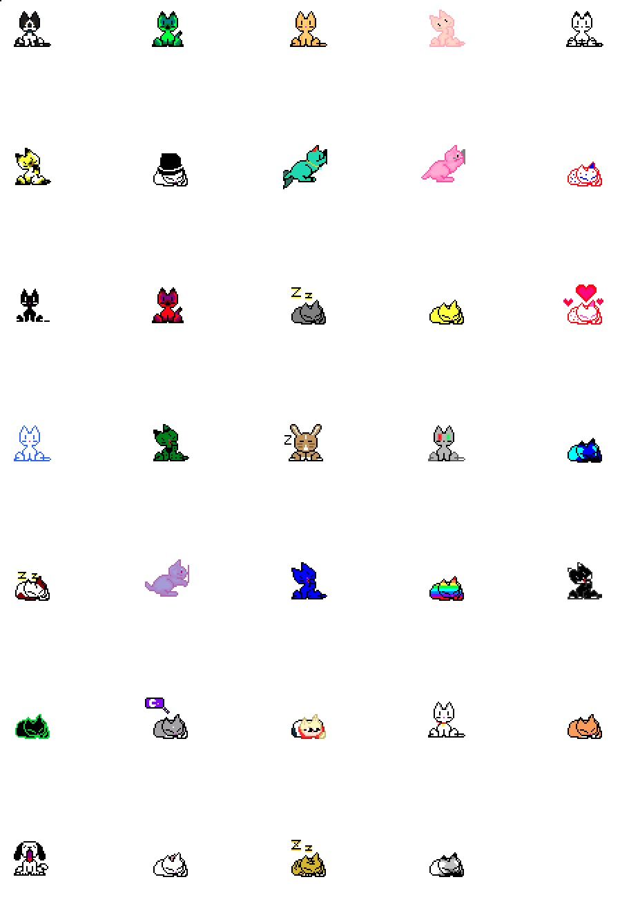

## Neko

[Neko](<https://en.wikipedia.org/wiki/Neko_(software)>) is an animated cursor-chasing cat. This version is adapted from [oneko.js](https://github.com/adryd325/oneko.js), inspired by [Web Neko](https://webneko.net/), and sourced from [The Neko Archive](https://bomvel.neocities.org/neko/).

See a live [demo here](https://rin.dev).

## Getting Started

1. Clone the repository

```bash
git clone https://github.com/rinvii/neko.git
cd neko
```

2. Install dependencies

```bash
pnpm install
```

3. Run the Next.js app

```bash
pnpm dev
```

## Notes

- Neko can be persisted across different pages when used in a Next.js layout file
- Neko is clickable, either following the cursor or returning to its starting position
- In React, Neko must be initialized with useEffect
- Neko can be dragged

## All Versions


